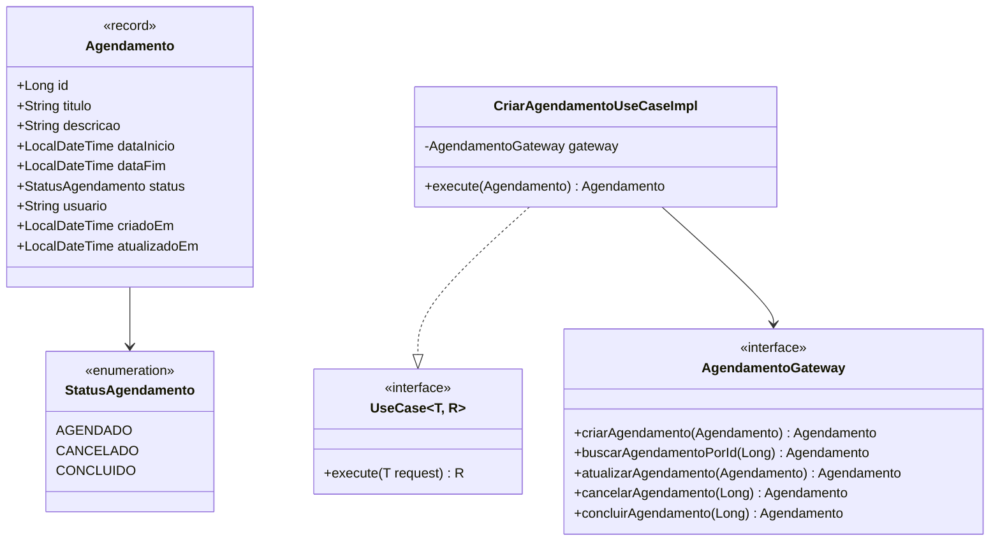
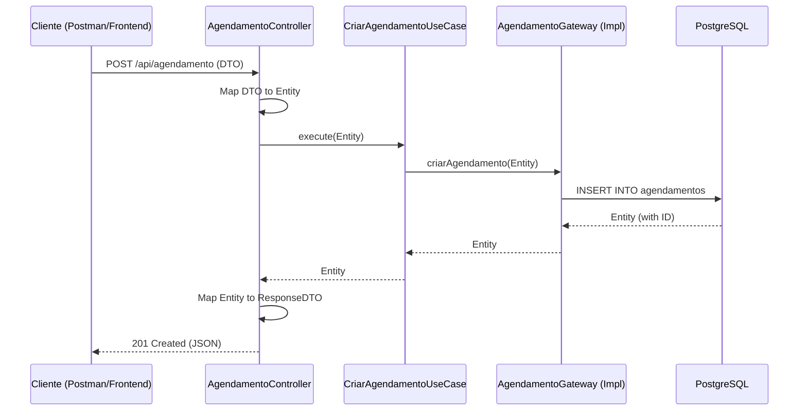

# Mini Agendamento API 📅

[](https://www.oracle.com/java/)
[](https://spring.io/projects/spring-boot)
[](https://blog.cleancoder.com/uncle-bob/2012/08/13/the-clean-architecture.html)
[](LICENSE)

Uma solução robusta e escalável para gerenciamento de agendamentos, construída com foco em **Clean Architecture**, **SOLID** e **Design Patterns**. Este projeto demonstra a aplicação de práticas modernas de desenvolvimento Java para criar um sistema desacoplado e de fácil manutenção.

---

## 📖 Sobre o Projeto

O **Mini Agendamento API** é um sistema de backend projetado para gerenciar o ciclo de vida de agendamentos. Ele permite que usuários criem, consultem, atualizem e gerenciem o status de seus compromissos de forma eficiente.

### Principais Diferenciais Técnicos:
- **Independência de Framework:** A lógica de negócio central (Core) não depende de bibliotecas externas ou frameworks.
- **Testabilidade:** Arquitetura desenhada para facilitar testes unitários e de integração.
- **Evolução Gradual:** Facilidade para trocar o banco de dados ou o framework web sem afetar as regras de negócio.

---

## 🏗️ Arquitetura e Design

O projeto segue rigorosamente os círculos da **Clean Architecture**, garantindo que a direção das dependências aponte sempre para dentro (em direção às regras de negócio).

### Camadas do Sistema

| Camada | Responsabilidade | Componentes Principais |
| :--- | :--- | :--- |
| **Core (Domain)** | Regras de negócio puras e contratos. | `Entities`, `Use Cases`, `Gateways` |
| **Infrastructure** | Detalhes técnicos e implementações. | `Persistence`, `Web/REST`, `Configuration` |
| **Application** | Orquestração e mapeamento de dados. | `DTOs`, `Mappers`, `Beans` |

### Princípios Aplicados e Design Patterns
- **SOLID:** O projeto adere aos princípios SOLID para garantir um código flexível e sustentável. Destacamos:
    - **SRP (Single Responsibility Principle):** Cada classe, como os Use Cases, possui uma única razão para mudar.
    - **OCP (Open/Closed Principle):** O sistema é aberto para extensão (novos Use Cases) e fechado para modificação (no Core).
    - **DIP (Dependency Inversion Principle):** O Core depende de abstrações (interfaces `AgendamentoGateway` e `UseCase`), e não de implementações concretas da Infrastructure.
- **Design Patterns:**
    - **Repository Pattern:** Implementado através da interface `AgendamentoGateway` no Core e sua implementação na camada de `persistence`.
    - **Dependency Injection (DI):** Utilizado pelo Spring Boot para gerenciar e fornecer as dependências, garantindo o baixo acoplamento.
    - **Factory Method:** Implícito na criação de objetos de domínio dentro dos Use Cases.
- **DRY (Don't Repeat Yourself):** Centralização de lógicas comuns e uso de Mappers.
- **Padrão Hexagonal (Ports & Adapters):** O Core atua como o "Hexágono", e as camadas de Infrastructure (REST Controller, JPA Repository) atuam como "Adaptadores" que se comunicam com o Core através de "Portas" (Use Cases e Gateways).
- **Fail-Fast:** Validações rigorosas na entrada de dados via Bean Validation.

---

## 📊 Modelagem de Dados e Fluxo

### Diagrama de Classes (Core Domain)



### Fluxo de Execução (Diagrama de Sequência)



---

## 🛠️ Stack Tecnológica

- **Linguagem:** Java 21 (LTS)
- **Framework:** Spring Boot 3.x
- **Persistência:** Spring Data JPA / Hibernate
- **Banco de Dados:** PostgreSQL
- **Migrações:** Flyway
- **Produtividade:** Lombok & MapStruct
- **Documentação:** Swagger/OpenAPI (Opcional)

---

## 🚀 Guia de Instalação e Execução

### Pré-requisitos
- JDK 21+
- Maven 3.8+
- Docker (opcional, para o banco de dados)

### Passo a Passo

1. **Clone o repositório:**
   ```bash
   git clone https://github.com/devmatheussousa/miniagendamento-.git
   cd miniagendamento-
   ```

2. **Configuração do Ambiente:**
   Edite o arquivo `src/main/resources/application.yml` (ou `.properties`) com suas credenciais do PostgreSQL:
   ```properties
   spring.datasource.url=jdbc:postgresql://localhost:5432/agendamento_db
   spring.datasource.username=seu_usuario
   spring.datasource.password=sua_senha
   ```

3. **Build do Projeto:**
   ```bash
   mvn clean install
   ```

4. **Execução:**
   ```bash
   mvn spring-boot:run
   ```

---

## 🛣️ API Reference (Endpoints)

### Agendamentos

| Método | Endpoint | Descrição | Status Code |
| :--- | :--- | :--- | :--- |
| `POST` | `/api/agendamento` | Registra um novo agendamento | 201 |
| `GET` | `/api/agendamento/{id}` | Detalhes de um agendamento específico | 200 |
| `PUT` | `/api/agendamento` | Atualiza dados de um agendamento | 200 |
| `PATCH` | `/api/agendamento/{id}/cancelar` | Altera status para CANCELADO | 204 |
| `PATCH` | `/api/agendamento/{id}/concluir` | Altera status para CONCLUIDO | 204 |

---

## 🤝 Contribuição

1. Faça um **Fork** do projeto.
2. Crie uma **Branch** para sua feature (`git checkout -b feature/NovaFeature`).
3. Faça o **Commit** de suas alterações (`git commit -m 'Add: Nova Feature'`).
4. Faça o **Push** para a Branch (`git push origin feature/NovaFeature`).
5. Abra um **Pull Request**.

---

## 📄 Licença

Este projeto está sob a licença MIT. Veja o arquivo [LICENSE](LICENSE) para mais detalhes.

## 📚 Referências e Links Úteis

- [Clean Architecture (Robert C. Martin)](https://blog.cleancoder.com/uncle-bob/2012/08/13/the-clean-architecture.html)
- [Spring Boot Documentation](https://docs.spring.io/spring-boot/docs/current/reference/htmlsingle/)
- [SOLID Principles in Java](https://www.baeldung.com/solid-principles)
- [Mermaid.js Documentation](https://mermaid.js.org/)

---
Desenvolvido com ❤️ por [Matheus Sousa](https://github.com/devmatheussousa)
